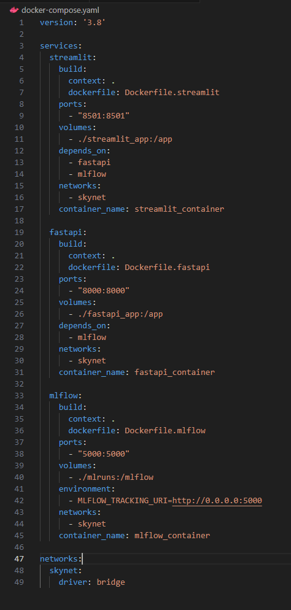

# Text extractor using easyOCR
- This project was built as part of [Lab3](https://github.com/hrhouma/begining_IA_part1/blob/main/lab3.md) for 'Mise en place Ecosysteme IA'
- The goal of this project is to create a working app end-to-end using streamlit, fastAPI, mlflow and docker-compose
- frontend: streamlit
- backend: fastAPI
- experience tracker: mlflow
- deployment: docker-compose

## Use
I used a VM with ubuntu to run my tests.
From console, execute 
```
docker-compose up
```

## Process


- The very first moment we start the services, we're gonna download the OCR model and store it under the fastAPI container
- At that same moment, we'll load the experiment 'EASYOCR' in mlflow (while launching fastAPI)
- User will upload an image using streamlit
- The image is sent to fastAPI to be treated. We call /extract to obtain the text from the image
- fastAPI will measure how long it takes to extract the text from image. This value will be stored as a metric in mlflow
- The results (fount text in image) will be sent back to streamlit as json
- The site will show up findings

## docker-compose


- There are 3 services dans yaml file: streamlit, fastapi et mlflow
- Each service launches its own Dockerfile
- The 3 services are connected through the same network: 'skynet' 🤖
- I've added also the dependencies between the services


## streamlit
To launch streamlit, we use the following command (also included in Dockerfile.streamlit)
```
streamlit run app.py
```
- Streamlit is the user interface.  
Here is an example when it runs for the first time  

  
- Here after uploading the image.  
Note that there is a little 'robot' indicating that the OCR model is running 'bip bip bip'  

  
- Here are the results.  
  

 
## fastAPI
To launch fastAPI, we use the following command (also included in Dockerfile.fastapi)
```
uvicorn main:app --host 0.0.0.0 --port 8000 
```
- With fastAPI, we're gonna create an API available to everyone.  
- There are 2 methods available: root method '/' will show up a message 'Hello World' and '/extract' will extract the text from image  
  

 

## mlFlow
To launch fastAPI, we use the following command (also included in Dockerfile.mlflow)
```
mlflow server --host 0.0.0.0 --port 5000
```  
mlflow allows to track experiments and the cycle of life of the project.  
In this case, since we're not tuning any parameters, we're gonna use mlflow to measure how much time it takes to extract the text from the image every time.  
This is not a complicated metric, but it can be used to understand how each service interacts with the others (fastapi and mlflow)


## Additional comments


- The project was created using VS code and tested in ubuntu  
- Each image was created from a clean image python3.11 from dockerhub. I've just added the list of dependencies needed in requirements.txt
- I really liked this way of organising Dockerfiles, all under the same level and have a docker-compose.yaml orchestrate all containers
- The model used in this project has been already trained. If needed you can train you own model but that will take more time and resources.  
The model comes directly from the library easyOCR avec 2 languages: english (en) et french (fr). I've tested the model in english only.
- If you decide to go and test this project, make sure you have enough disk space. It takes a lot of time to create the image for fastAPI
- I spent quite some time trying to debug and understand how each piece works. As lessons learned:
1. The name of the service in the yaml file becomes the 'url' to call the service if all containers are in the same network  
2. We cannot test directly the url of the service in the dev environment (visual studio par exemple) because we're not in the shared network  
3. docker-compose logs et docker exec it bash are really userful  
4. docker network ls will list all networks available
5. docker network inspect _name_ allows to see which containers are linked.   

- To investigate:  
1. If we change the code in visual studio code, the container changes as well. I dont understand why this happens without having to rebuild the image 
2. How does it work if we need to use CUDA for our model. Does it work the same way to deploy packages and test?
